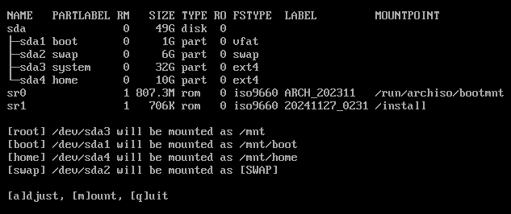

# ez-arch-install

[](LICENSE)

`ez-arch-install` is a streamlined wizard to simplify the installation of Arch Linux.

## Features

- **Guided installation:**</br>
     Designed with interactive steps to simplify the Arch Linux installation process.
- **Disk management:**
  - Manage disk partitions.
  - Format disk partitions (guided).
  - Mount disk partitions (automated for GPT disks).
- **Bootloader setup:**
  - Automated `grub` configuration for MBR partitioned disks.
  - Automated `systemd-boot` configuration for GPT partitioned disks.
  - Choose between a GUI, CLI, or mixed environment during installation.
- **Package installation:**</br>
     Configurable list of packages to be installed (defined in the `/setup` folder).
- **GUI environment installation:**</br>
     Install and customize a desktop environment (defined in `/setup/gui-environment.txt`)
- **User management:**</br>
     Manage user accounts, groups and `sudo` permissions.
- **Service management:**</br>
     Configure services to start at boot (defined in `/setup/systemd-services.txt`)
- **System configuration:**
  - Assisted locale, timezone, and keyboard layout setup.
  - Enable or disable the `multilib` repository.
  - Set the system's `hostname`.

## Planned Features

The following features are planned for future updates to `ez-arch-install`:

- **Firewall configuration:**<br>
     Add the possibility to enable and configure a firewall.
- **Driver installation:**<br>
     Installation and configuration of hardware drivers (graphics cards, printers, etc).
- **Express installer mode:**<br>
     Introduce an `express_installer.sh` script for quick and fully-automated installations with minimal user input.
- **Performance tuning:**<br>
     Provide options to optimize system performance (kernel parameters, caching, etc).
- **Backup configuration:**<br>
     Add support for setting up and configuring backup tools.
- **Power management:**<br>
     Include options to manage power settings for laptops.
- **Custom script support(?):**<br>
     Allow users to include and execute their own scripts during installation.

## Preview

#### Main menu


#### Disk setup



#### Mid installation


#### Timezone setup


#### Keyboard setup


#### User management


## Usage

### Prerequisites
- A stable internet connection.
- A bootable [Arch Linux installation](https://archlinux.org/download/) medium (USB, DVD/CD, or ISO).
- A storage medium to hold the `ez-arch-install` folder (can be the same as the bootable medium).

### Steps

1. **Prepare the installation files**</br>
   Copy the `ez-arch-install` folder to a storage medium (USB, DVD/CD or ISO) that will be accessible from the Arch Linux installation environment.

2. **Boot into the Arch Linux installation**</br>
   Boot your system using the bootable Arch Linux installation medium.

3. **Mount the installation wizard**</br>
   Run the following commands to make the `ez-arch-install` folder accessible:
   ```bash
   mkdir /install
   lsblk -o +LABEL   # List connected storage devices
   mount /dev/{STORAGE_DEVICE} /install
   ls /install       # Verify the wizard files are accessible
   ```
   Replace `{STORAGE_DEVICE}` with the device identifier of your storage medium.

4. **Start the installation wizard**</br>
   Run the following commands to start the `arch_installer.sh` wizard:
   ```bash
   cd /install/ez-arch-install
   chmod +x arch_installer.sh
   ./arch_installer.sh
   ```

5. **Follow the installation wizard**</br>
   The wizard will guide you step-by-step through the installation process.
   Follow the on-screen instructions and prompts to setup and configure your system.

### Post-Installation
After completing the "**Install Arch Linux**" step, the wizard offers additional configuration options:
1. **System Configuration:**
   - Set the system's locale.
   - Adjust the timezone for accurate system time.
   - Configure the keyboard layout to match your keyboard.
   - Enable or disable the `multilib` repository (for 32-bit package support).
   - Assign a `hostname` for your system.

2. **User Management:**
   - Configure additional users.
   - Create and manage user groups.
   - Set up `sudo` for administrative privileges.

3. **Post-Install Tasks:**
   - Install development packages (defined in `/setup/dev-packages.txt`).
   - Install GUI application packages (defined in `/setup/gui-packages.txt`).

## Contributing

Contributions to improve the wizard or its documentation are welcome. Feel free to:
1. Fork the repository.
2. Make your changes.
3. Submit a pull request.

## License

This project is licensed under the MIT License. For more details, open the [LICENSE](LICENSE) file in the repository.

## Disclaimer

This wizard is provided as-is, without warranty of any kind, as outlined in the [LICENSE](LICENSE).

**Always** <u>back up important data</u> **before** proceeding with any installation or system modification.

The author takes no responsibility for any issues that may arise from its use.<br>
Proceed at your own risk.
